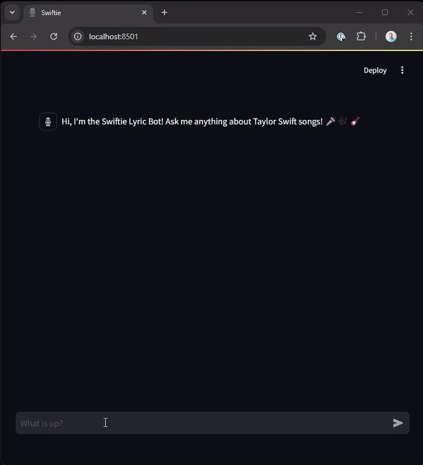
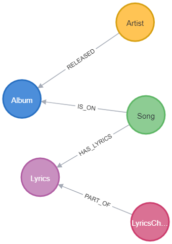
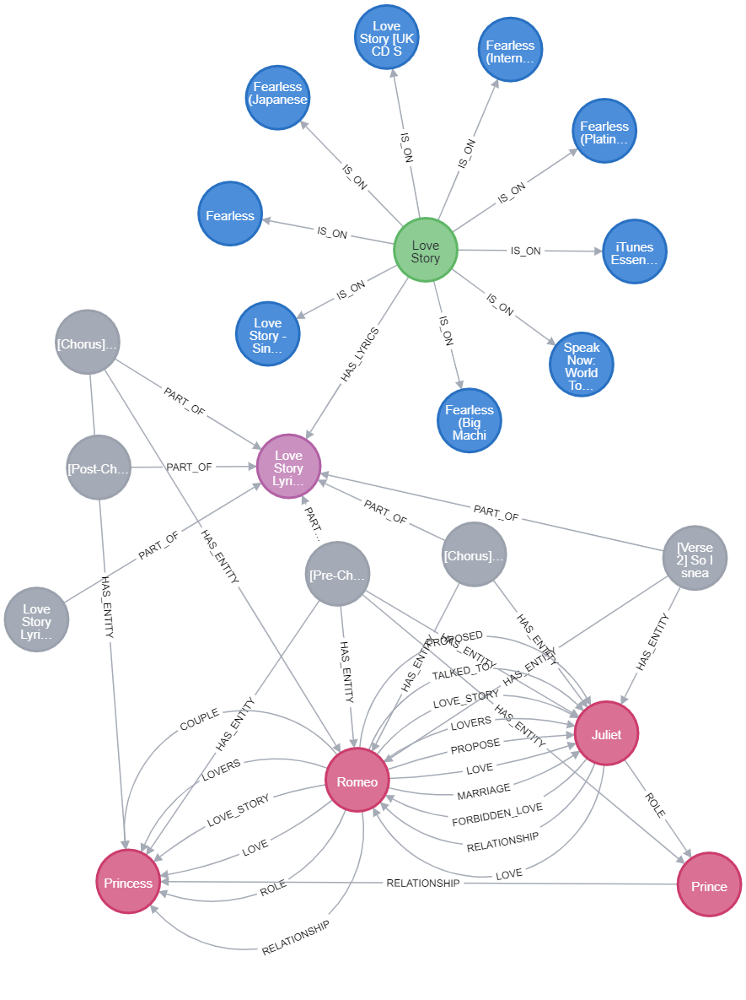

# Taylor Swift Lyric Chatbot

Welcome Swiftie! 

Have you ever wondered what a large language model (LLM) would make of Taylor Swift's lyrics? Me too!

This chatbot uses a Neo4j graph database of Taylor Swift lyrics to search for lyrical meaning and gain insight into the author's mind... 
Obvs not really! 
It's an analytical model, not a mind reader. 
But ... it is a bit of fun; if you're fan, try asking it about your favorite track.

> What song was inspired by William Shakespeare's Romeo and Juliet?

> ... Love Story

> What is Love Story about?

> ... "Love Story" by Taylor Swift tells the story of a young couple who are in love but face opposition from the girl's family. The lyrics reference Shakespeare's Romeo and Juliet as the singer longs for a love story like theirs. The song conveys themes of love, perseverance, and hope, as the couple overcomes obstacles to be together.



## Run

You can run the chatbot and Neo4j database in [Docker](https://docs.docker.com/engine/install/).

You will need an OpenAI API Key to run the chatbot; you can get one by signing up at [platform.openai.com](https://platform.openai.com).

1. Copy the `.env.example` environment file to `.env` and add your OpenAI API Key.

2. Run the chatbot and Neo4j database using docker:

    ```bash
    docker compose up
    ```

The first time the chatbot runs, it will populate the Neo4j database with the Taylor Swift lyrics data; 
this will take a while.

Open the chatbot at [http://localhost:8501](http://localhost:8501).

You can view the database at [http://localhost:7474/browser/](http://localhost:7474/browser/).

## Data model

A Neo4j graph database holds the song data with the following structure:



OpenAI's `text-embedding-ada-002` model was used to create the embeddings for the lyrics.
A vector index allows for the retrieval of lyrics that are most similar to a given input.

A LLM has analyzed the lyrics to extract entities and relationships to create a knowledge graph. 
The chatbot used the knowledge graph to gain additional context when analyzing lyrics.

The entities are linked to the related lyric chunks:


 

## Installation

You will need [Python](https://python.org) installed and a [Neo4j](https://neo4j.com) database to run the chatbot.

### Python installation

Install the required packages using pip:

```bash
pip install -r requirements.txt
```

### Neo4j Database

You can set up a free Neo4j cloud database using [Neo4j Aura](https://console.neo4j.io) or run a local database using [Neo4j Desktop](https://neo4j.com/download/).

> If using Neo4j Desktop you will need to install APOC from plugins menu.

### Environment

Copy the `.env.example` environment file to `.env`.

Add your OpenAI API Key and Neo4j database connection details.

### Run

You must load the database with the Taylor Swift album, song, and lyric data.

Unzip the `data/taylor_swift_tracks.csv.zip`, `lyrics.csv.zip`, and `lyrics-chunks.csv.zip` files and copy to the Neo4j `import` directory.

Run the `data/build_graph.py` program to populate the database: 

```bash
python swiftie-lyric-bot/data/build_graph.py
```

> This will use the unziped CSV files and the `data/knowledge-graph-cache` to build the graph.

Run the chatbot using `streamlit`:

```bash
streamlit run swiftie-lyric-bot/chatbot/bot.py
```

## Data extraction

If you want to re-extract and rebuild the data, follow these instructions.

> You dont need to do this - all the data is contained in the repository. However if you wanted to build a graph of another artists lyrics, you could apply the same process.

1. Extract the albums, songs, and lyrics:

    > You will need to add `GENIUS_CLIENT_ACCESS_TOKEN` to the `.env` file. See [lyricsgenius.readthedocs.io/](https://lyricsgenius.readthedocs.io/) for LyricsGenius installation instructions.

    ```bash
    python swiftie-lyric-bot/data/extract_lyrics.py
    ```

    This will create the `taylor_swift_tracks.csv` and `lyrics.csv` files.

2. Chunk the lyrics and create embeddings:

    ```bash
    python swiftie-lyric-bot/data/chunk_lyrics.py
    ```

    This will create the `lyrics-chunks.csv` file.

3. Create the knowledge graph:

    ```bash
    python swiftie-lyric-bot/data/create_kg.py
    ```

    This will use the `knowledge-graph-cache` or call OpenAI if it cannot find a cache for the song..

## Project Sructure

* `./swiftie-lyric-bot` - main project.
    * `chatbot` - the chatbot application.
        * `agent.py` - module containing the chat agent code.
        * `bot.py` - main streamlit chatbot application.
        * `graph.py` - Neo4j database connection.
        * `llm.py` - OpenAI LLM object.
        * `lyrics.py` - Lyrics Vector Retriever.
        * `song_data.py` - Cypher Retriever for getting structured song data.
        * `utils.py` - utility functions for write messages and getting session IDs.
    * `cypher-queries` - Example cypher queries.
    * `data` - data and extract tools.
        * `knowledge-graph-cache` - Cached pickled GraphDocuments created by `create_kg.py` to save calling the LLM.
        * `lyrics` - Taylor Swift lyrics by track id.
        * `build_graph.cypher` - Cypher to build the graph of Albums, Songs, Lyrics from the CSV files.
        * `chunk_lyrics.py` - prepare the data for input into Neo4j, including chunking Lyrics and creating vector embeddings, creates the `lyrics-chunks.csv` file.
        * `create_kg.py` - creates the knowledge graph - extracts the entities and relationships by passing the lyric chunks to an LLM and populating the graph.
        * `extract_lyrics.py` - download albums, tracks, and lyrics from genius.com, creates files `taylor_swift_lyrics.csv` and `lyrics.csv`.
        * `lyrics-chunks.csv` - Lyric chunks and embedding - embeddings created using OpenAI's `text-embedding-ada-002` model.
        * `lyrics.csv` - Lyrics by song/track id.
        * `taylor_swift_tracks.csv` - Taylor Swift album and song/track data.
* `chatbot.Dockerfile` - Dockerfile for the chatbot application.
* `docker-compose.yml` - Docker compose file for running the chatbot and Neo4j database.
* `.env.example` - example environment file.
* `requirements.txt` - PyPI packages required to run the application.

## Recognition

I used the [Taylor Swift Lyrics](https://github.com/ishijo/Taylor-Swift-Lyrics) project by [ishijo](https://github.com/ishijo) as the basis for the lyric extraction program.